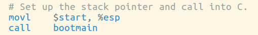
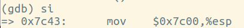

# Homework: boot xv6

## Boot xv6

qemu: simulator for x86 architecture

gdb: the GNU project debugger

## Finding and breaking at an address

```
nm kernel | grep _start
```

Find the entry point of the kernel, in this case, the address is **0010000c**.

## What is on the stack?

- 设置断点 at 0x7c00(the start of the boot block)进行单步执行 Where in bootasm.S is the stack pointer initialized? 
   
  其中%esp is the stack pointer, 当把值传给%esp时即完成初始化
  

- 接着单步执行就跳转到**bootmain**(0x7d3b) 可以看到%eip has changed to the address of bootmain 0x7d3b, return address is stored in 0x7c00 - 4 = 0x7bfc.

- The first assembly instructions of bootmain do to the stack? 把%ebp压入栈中, 然后move esp to ebp 所以%esp and %ebp同时指向栈顶 然后将esi, edi, ebx等寄存器压入栈中，将栈顶指针esp减去0xc. 所以esp是一直指向栈顶的指针，而ebp只是存取某个时刻的栈顶指针以方便对栈的操作。

- look for the call that changes eip to 0x10000c. eip寄存器中存放的是指令地址，在entry function中 call the function at the address 0x10000c which is stored in the 0x10018.
